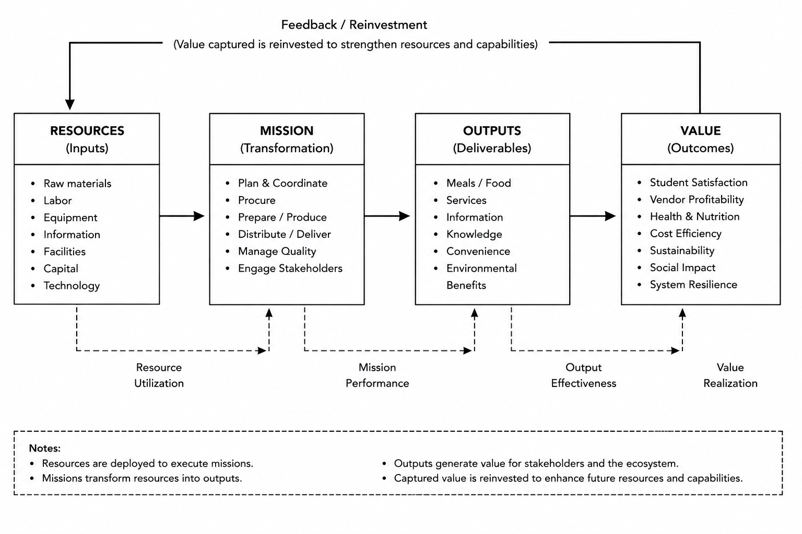

# Konsep









{#fig-rmov-detail}







## Digital-Twin Specification Tables

The following tables connect the Mini-Lab's theoretical constructs to observables, delimit the claims supported by the current evidence, and specify the online-update, sustainability, experimental-fairness, calibration, and validation contracts.




























